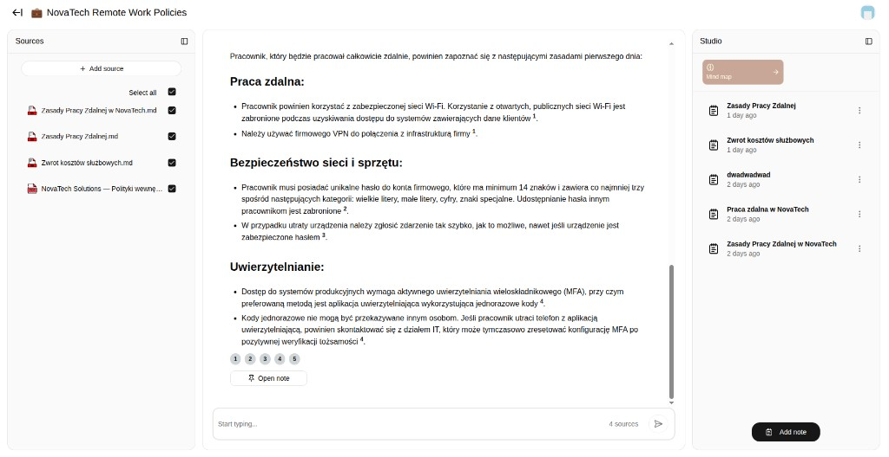
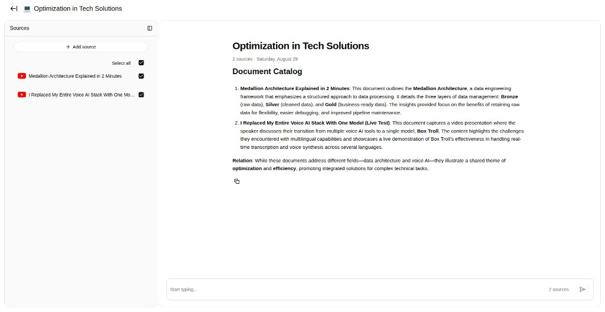
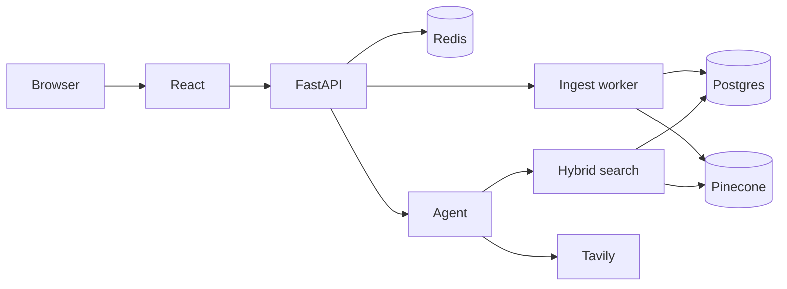

# Folio

Chat with your own files. Answers that need a fact from a document come with a citation, not a guess.

**Live demo:** [https://3.78.61.131.sslip.io](https://3.78.61.131.sslip.io)

[](https://3.78.61.131.sslip.io)



## Try it

1. Open the demo and choose **Sign up** (email + password, min. 6 characters).
2. Confirm the address from the mail Supabase sends — check spam if it does not show up.
3. **Sign in**, create a conversation, **Add source** (PDF, DOCX, TXT, MD, image, or a YouTube link).
4. Ask a question about that file. Toggle sources on the left to control what the model may use.

Production accounts are rate-limited so a public demo stays up: **3 uploads / day**, **20 messages / day**, **10 conversations**, **5 MB / file**. Limits reset at 00:00 UTC.

## What it does

- Conversations with streaming replies and clickable citations
- Per-turn source selection — files you do not select are not searched
- Background ingest (parse → chunk → embed) so upload does not block the API
- Hybrid retrieval: Postgres full-text + Pinecone vectors, then Cohere rerank
- An agent that chooses among `search_documents`, `summarize_context`, and `web_search`
- Email/password auth (Supabase), prompt-injection checks on retrieve, per-user quotas

## Stack

| Area | Choice |
| --- | --- |
| Frontend | React, TypeScript, Vite, Tailwind, TanStack Query |
| API | FastAPI, SSE |
| Agent | LangChain agent (`gpt-4o`), LangSmith traces |
| Data | Postgres (Supabase), Redis, Pinecone |
| Ingest | Docling / PyMuPDF, worker process, Redis queue |
| Ship | Docker Compose, GitHub Actions → ECR → EC2, Caddy TLS |

## How it works



Upload stores the file and returns immediately. An ingest worker parses it, chunks it, writes vectors to Pinecone and text to Postgres. Chat runs an agent over SSE; Redis is the broker so more than one API process can share a run. Factual questions hit hybrid search (FTS + vectors + rerank). Summaries and web lookup are separate tools, not stuffed into one prompt.

## Run locally

You need Docker Compose v2 and a filled `.env` (OpenAI, Pinecone, Supabase, Cohere; see [`.env.example`](.env.example)).

```bash
cp .env.example .env
docker compose run --rm --no-deps backend alembic upgrade head
docker compose up --build
```

App: [http://localhost:8080](http://localhost:8080) · API: [http://localhost:8000](http://localhost:8000)

## Tests

```bash
cd backend && uv sync --locked --group dev && uv run pytest
cd frontend && npm ci && npm run lint && npm run build
```

CI runs the same checks on every deploy. Push to `main` builds images, pushes them to ECR, migrates Postgres, and rolls the stack on EC2.
